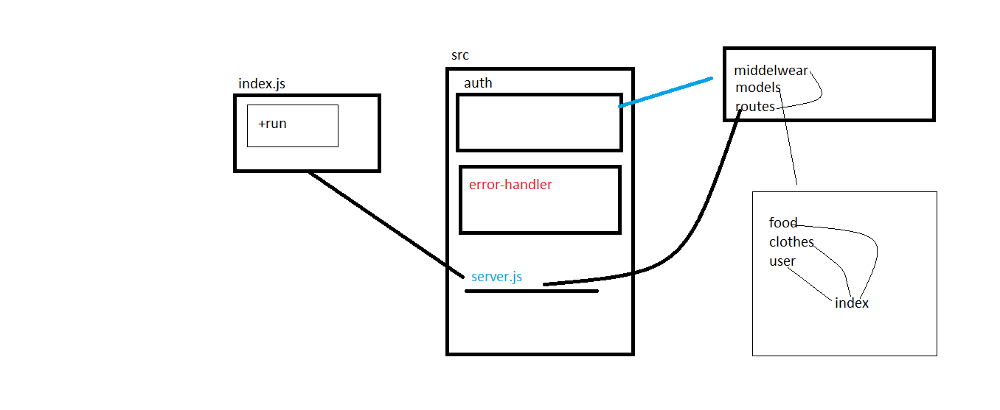

# auth-api

## Author: ahmad nofal
- [tests report](https://github.com/abu-nofal/auth-api/actions)
- [front-end]()
## Setup
`.env` requirements
- PORT - [4000] ||[8000]

`npm start`
- Endpoint: /signup
- Endpoint: /signin
- Endpoint: /api/v1/:model
- Endpoint: /api/v2/:model
- Endpoint: /users
- Endpoint: /secret


- Returns Object

```
{
  "username":"name provided",
  "password":"pass",
  "role":[user,admin,editor]
},
{
    "name":"ahmad",
    "calories":"test123",
    "type":"fruite"

},
{
    "name":"ahmad",
    "color":"red",
    "size":"xl"

}
```
## Tests
- Unit Tests: npm run test
- Lint Tests: npm run lint
UML




## link for deploy 

- [for heroku](https://basic-auth-n.herokuapp.com/)